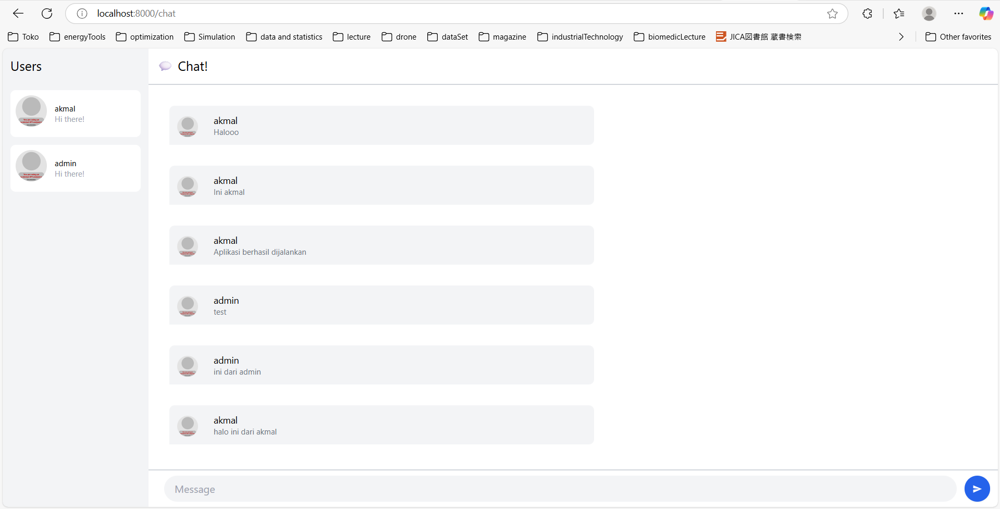
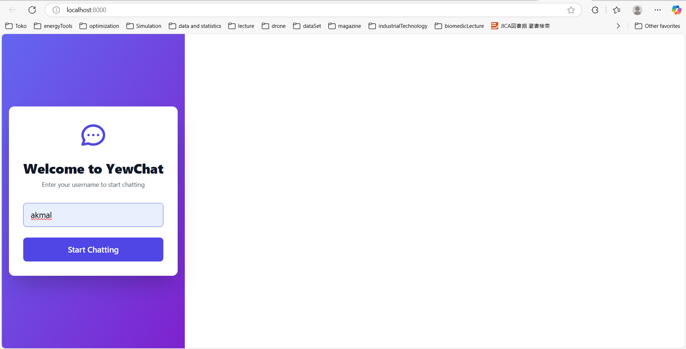
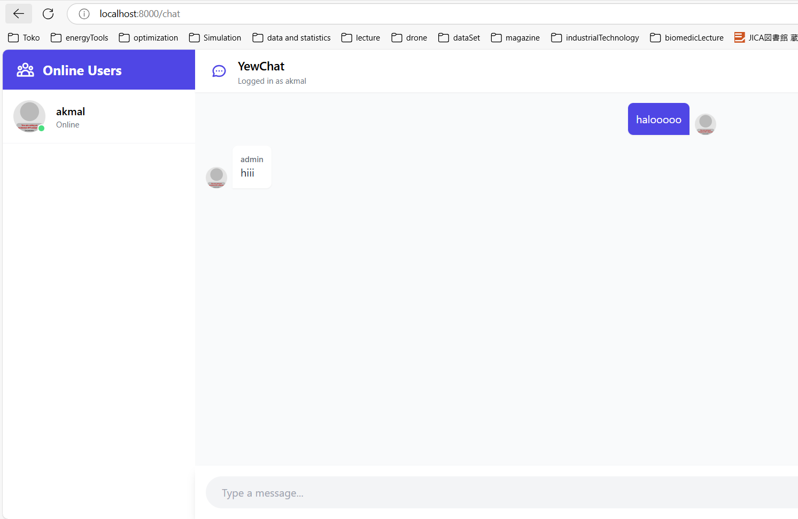

## AdvProg - Tutorial Module 10
<h2>
Nama   : Muhammad Akmal Abdul Halim

Kelas  : B

NPM    : 2306245125
</h2>

## Experiment 3.1: Original code

Disini kita perlu menjalankan terlebih dahulu SimpleWebSocketServer yang sudah disediakan oleh jtordgeman. Baru habis itu jalankan di repo YewChat. Terlihat kita sudah bisa saling chat secara realtime di server tersebut.

## Experiment 3.2: Be Creative!

Saya mengubah halaman login agar menjadi lebih menarik dan interaktif dengan mengubah menjadi di justify ke kiri dan menambahkan background. Dan juga saya menambahkan efek hover ketika user mengarahkan ke input username. Lalu saya mengubah tampilan chat juga dengan mengganti text yang menampilkan user online yang tadinya hanya bertuliskan user menjadi Online users. Lalu saya juga menambahkan warna pada header nya agar terlihat lebih menarik.